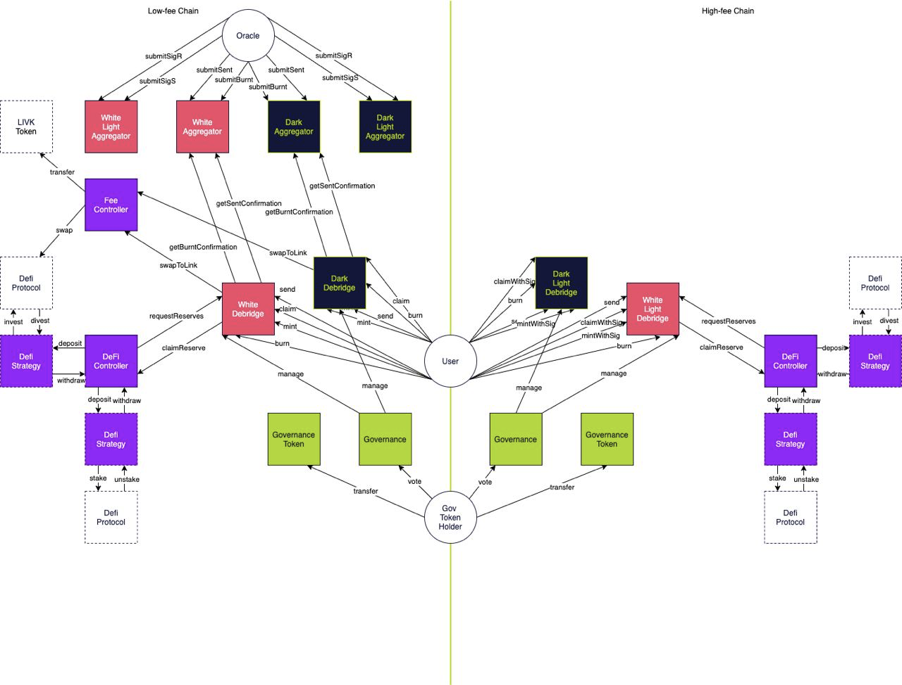

# Getting started

**deBridge** is a secure interoperability layer for Web3 that enables arbitrary complex cross-chain interactions in a single transaction. Due to the ability to simultaneously send messages and value deBridge acts as a unified framework for all cross-chain needs and is capable of interconnecting any smart contract on any blockchain.



This guide is a great starting point that covers all necessary topics to get you started building cross-chain interactions on top of the deBridge protocol and its' infrastructure.

## Build your first deApp

Let's consider the following idea of the conceptual dApp consisting of two smart contacts: a `Counter` smart contract residing in one chain, where the integer property (`counter`) is stored and can be incremented by a call initiated by **and only by** the `Incrementor` contract from another chain. In other words, when we perform some action against the `Incrementor` contract, it initiates a cross-chain transaction (a submission, in terms of the deBridge protocol) which is being started on one chain, relayed to, and then executed on another chain; during this cross-chain transaction, a `Counter` contract is called. The following image presents a high-level overview of a cross-chain transaction we are going to achieve:


This document will guide you through building contracts, scripts and unit tests necessary to make this project happen. A self-contained source code of this dApp can be found on Github: [`debridge-finance/debridge-cross-chain-dapp-example.git`](https://github.com/debridge-finance/debridge-cross-chain-dapp-example).

Though hypothetical, this example may be used as a foundation for real-life cases, e.g. you may want to track the supply of your token issued across multiple chains on one chain, or send price feeds and trigger events or even actions to buy or sell, etc.

### Making the `Counter` contract

Let's start with making the counter contract, responsible for keeping the integer property and accepting calls to increment it. Obviously, there should be a property and a method:

```solidity
contract CrossChainCounter {
    uint256 public counter;

    function receiveIncrementCommand(uint8 _amount) external {
        counter = counter + _amount;
    }
}
```

Looks simple! However, we need to put some security restrictions on this method: first, we must ensure it can be called by the `deBridgeGate` smart contract only, and second, this call should occur only during the cross-chain transaction originating from the `Incrementor` smart contract at the specific address on another chain. How can this be achieved?

The cross-chain transaction is a message from the origin chain with a payload that includes (among other info) the packed address of the initiator (`nativeSender`) - i.e. an entity that actually initiated the transaction by calling the `deBridgeGate` contract on the origin chain. When the cross-chain transaction is being relayed, the `deBridgeGate` contract on the destination chain temporarily exposes the state of the transaction it currently handles via its properties and then calls a target smart contract (whose address is also a part of a payload) through its helper intermediary. It means that the contract on the target address may access this data.

To make this happen, the `Counter` must know the `deBridgeGate` contract's address on the current chain, so it is reasonable to inject it via a constructor:

```solidity
contract CrossChainCounter {
    IDebridgeGate public deBridgeGate;

    constructor(address deBridgeGate_) {
        deBridgeGate = IDebridgeGate(deBridgeGate_);
    }
}
```

Then, we can start putting restrictions on the `receiveIncrementCommand` method using a modifier. The first obvious check we must perform is to ensure this method is called by the `deBridgeGate`'s helper intermediary - a `CallProxy` contract responsible for performing actual calls (the `deBridgeGate` contract doesn't make calls directly for security considerations):

```solidity
contract CrossChainCounter {
    modifier onlyCrossChainIncrementor {
        // caller must be CallProxy
        require(msg.sender == deBridgeGate.callProxy())

        // execute the rest
        _;
    }
}
```

It is implied by the protocol that such calls may occur only while `deBridgeGate` handles some cross-chain transactions relayed from another chain.

The not-so-obvious second check is related to our business logic: we want to ensure that a transaction is originating from the chain we know and from the contract we trust. To make such validation happen, we must preliminarily store the trusted address in the `Counter` contract, for example like this:

```solidity
contract CrossChainCounter {
    uint256 trustedChain;
    bytes trustedCrossChainCaller;

    function addChainSupport(
        uint256 _trustedChain,
        address _trustedIncrementor
    ) external onlyAdmin {
        trustedChain = _trustedChain;
        trustedCrossChainCaller = abi.encodePacked(_trustedIncrementor);
    }
}
```


Note that we store the packed version of the caller's address (mind that `trustedCrossChainCaller` is defined as `bytes` rather than the `address`): this happens because the `deBridgeGate` smart contract stores the byte representation of the native sender address to ensure future compatibility with non-EVM chains (e.g. Solana).


Later, after you deploy the `Incrementor` contract and get its address, we may let the `Counter` contract know about it by calling the `addChainSupport` method.

As soon as the `Counter` contract starts storing the caller's address, the cross-chain transaction is allowed to originate from, we may reuse this data and add the additional validation logic to the modifier:

```solidity
contract CrossChainCounter {
    modifier onlyCrossChainIncrementor {
        // take the callProxy instance
        ICallProxy callProxy = ICallProxy(deBridgeGate.callProxy());

        // caller must be CallProxy
        require(address(callProxy) == msg.sender);

        // origin chain must be known
        require(callProxy.submissionChainIdFrom() == trustedChain);

        // native sender (initiator of the txn on the origin chain) must be trusted
        // Bytes can't be compared directly, so take the hashes of them
        require(
            keccak256(callProxy.submissionNativeSender())
            == keccak256(trustedCrossChainCaller)
        );

        // execute the rest
        _;
    }
}
```

That's it! Now if we apply the given modifier to the target `receiveIncrementCommand` method, it becomes properly protected from unauthorized calls and ready to receive commands from the trusted contract on another chain:

```solidity
contract CrossChainCounter {
    function receiveIncrementCommand(uint8 _amount)
        external
        onlyCrossChainIncrementor // <-- mind the modifier applied
    {
        counter = counter + _amount;
    }
}
```

### Making the `Incrementor` contract

Now after we have the `Counter` contract and know its interface, we may design the `Incrementor` contract, which is responsible for initiating the cross-chain call to `Counter`'s `receiveIncrementCommand()`. First things first, we must let the `Incrementor` know where the `Counter` contract actually resides, so we inject it with the chain ID and address of the `Counter` contract, and we also specify the address of the `deBridgeGate` contract as well:

```solidity
contract CrossChainIncrementor {
    IDebridgeGate deBridgeGate;
    uint256 counterResidenceChainID;
    address counterResidenceAddress;

    constructor(
        address deBridgeGate_,
        uint256 counterResidenceChainID_,
        address counterResidenceAddress_
    ) {
        deBridgeGate = IDebridgeGate(deBridgeGate_);
        counterResidenceChainID = counterResidenceChainID_
        counterResidenceAddress = counterResidenceAddress_;
    }
}
```

For the sake of simplicity, let's assume that anyone may invoke the `Incrementor`, so let its interface be as simple as follows:

```
contract Incrementor {
    function increment(uint8 _amount) external payable {
        deBridgeGate.send{value: msg.value}(/* ... */)
    }
}
```

Crafting the deBridge submission (a cross-chain transaction) spins around the `deBridgeGate`'s `send()` method — the only entry point to initiate a transaction. It accepts plenty of non-trivial variables and structs. Let's overview all of them to make our submission happen.

#### A protocol fee

Worth mentioning that the `send()` method is marked as payable (meaning that it accepts ether during a call) and it is necessary to bypass enough ether to cover the protocol fee (or global fixed native fee, according to the internal definition) taken in the native currency of the chain. How much? deBridge tries to stick to around one dollar fee, so the fee varies from chain to chain: for example, at the time of writing the fee on Ethereum is 0.001 ETH and the fee on Polygon is 0.5 MATIC. You are advised to retrieve the actual fee amount by reading `deBridgeGate`'s `globalFixedNativeFee` property either on-chain:

```solidity
uint protocolFee = deBridgeGate.globalFixedNativeFee;
```

or by making a call to the RPC node:

```typescript
// ethers.js
const protocolFee = await deBridgeGate.globalFixedNativeFee();

// or web3.js
const protocolFee = await deBridgeGate.methods.globalFixedNativeFee().call();
```

Then pass the retrieved amount of ether to the call:

```solidity
deBridgeGate.send{value: protocolFee}(/* ... */);
```

#### Submission params

The gate accepts a variety of parameters through the `SubmissionAutoParamsTo` struct ([see its definition](https://github.com/debridge-finance/debridge-contracts-v1/blob/main/contracts/interfaces/IDeBridgeGate.sol#L41)), so it is important to understand each.

`executionFee` (or _included gas_) is the amount of the bridged asset that will be transferred to anyone who will deliver the message in the destination chain. In other words, this is a prepayment for potential gas expenses on the target chain, that will be transferred by the protocol to the address that claims the message. Anyone can run the keeper service to deliver messages and earn the `executionFee`. This is an advanced topic that runs out of the scope of this document, so for the sake of simplicity just set this value to zero.

`flags` is a bitmask of [toggles](https://github.com/debridge-finance/debridge-contracts-v1/blob/main/contracts/libraries/Flags.sol) affecting the behavior of the gate. The following flags are important to be set in our case:

* `REVERT_IF_EXTERNAL_FAIL` tells the `CallProxy` to revert the whole claim transaction in case the call to the receiver address (the callee contract on the destination chain; it is the `Counter` contract in our case) fails. Select the proper behavior wisely, ensuring it is aligned with the design of the callee contract: for example, the contract may fail deliberately and irretrievably so it may be reasonable to handle this call gracefully and mark the whole cross-chain transaction as succeeded. Keep in mind that once the claim transaction succeeds it `submissionId` is marked as used, so you cannot replay the transaction on the destination chain.
* `PROXY_WITH_SENDER` tells the `CallProxy` to expose the address that initiated the cross-chain transaction (submission) on the origin chain. Again, choose wisely: as for our case, the `Counter` contract expects this data, so we need to ensure it's presented on the destination chain.


`A complete list of flags with their description can be found on` [smart-contract-interface.md](smart-contract-interface.md "mention") page


`fallbackAddress` is the address on the destination chain where the bridged funds will be transferred to in case the call to the receiver address fails AND `REVERT_IF_EXTERNAL_FAIL` is not set. Since we don't bridge any funds (only the calldata), this field is not very important though it is mandatory to set it. Mind that this address must be packed into bytes.

`data` is the field for the `calldata` to execute on the destination chain. Not a big deal if the contracts reside on different chains: we can encode the call using the interface of the contract to call. In our case, we can import the interface of the `Counter` (`ICrossChainCounter`) and use it with the `encodeWithSelector` to produce valid instructions aligned with the interface of `Counter`'s `receiveIncrementCommand` method:

```solidity
bytes memory counterCalldata = abi.encodeWithSelector(
    ICrossChainCounter.receiveIncrementCommand.selector,
    _amountToIncrementBy
);
```

Summing it up, here is the complete snippet that produces an `autoParams` struct with settings that suit our needs:

```solidity
IDeBridgeGate.SubmissionAutoParamsTo memory autoParams;

autoParams.executionFee = _executionFee;

// Exposing nativeSender must be requested explicitly
// We request it bc of CrossChainCounter's onlyCrossChainIncrementor modifier
autoParams.flags = Flags.setFlag(
    autoParams.flags,
    Flags.PROXY_WITH_SENDER,
    true
);

// If something happens, we need to revert the transaction to avoid this call being lost
autoParams.flags = Flags.setFlag(
    autoParams.flags,
    Flags.REVERT_IF_EXTERNAL_FAIL,
    true
);

autoParams.data = abi.encodeWithSelector(
    ICrossChainCounter.receiveIncrementCommand.selector,
    _amountToIncrementBy
);

autoParams.fallbackAddress = abi.encodePacked(msg.sender);
```

Of course, you can craft the `autoParams` struct either on-chain (as in the example above) or off-chain using ethers.js or web3.js.

#### The `send()` args

The last major step towards successful submission is the understanding of args of the `send()` method.

1. `_tokenAddress` is the address of the ERC-20 token contract whose tokens you are willing to bridge additionally along with the `calldata`. If you are willing to bridge the native currency (e.g. ETH from Ethereum), **use the zero address (`address(0)`)**.
2. `_amount` is the amount of tokens (of the contract specified in the first arg) you are willing to bridge. Dealing with bridged assets is an advanced topic which out of the scope of this document, so **in this example, it is enough to set this arg to zero**. The following things are worth mentioning: first, the gate cuts a small 0.1% fee off the bridged asset; second, if you bridge the native currency of the origin blockchain, you must not forget to supply an additional amount to cover the protocol fee, but not include it in this arg value; third, the aforementioned `executionFee` (_included gas_) is counted in the currency of this bridged asset, so its decimals must be in sync with this asset; fourth, ERC-20 tokens should not be transferred in/out explicitly, use allowance and `safeTransferFrom` instead.
3. `_chainIdTo` sets the destination chain ID. Consider looking at chainlist.org for known chain IDs, see [the list of supported chains](https://docs.debridge.finance/contracts/mainnet-addresses) in our docs, or query `deBridgeGate.getChainToConfig` on-chain property for programmatic access to the list of chains supported by deBridge.
4. `_receiver` defines the address on the destination chain to receive bridged assets (if any) and be called by the `CallProxy` contract in case the call data is given. In the given example, we must set this arg to the address of the `Counter` smart contract.
5. `_permit` allows the caller to specify EIP-2612-compliant signed approval for the `deBridgeGate` contract to transfer the tokens specified in the first arg. Not applicable here.
6. `_useAssetFee` allows paying the protocol fee in the currency of the asset being bridged rather than the native currency of the blockchain. Not applicable here.
7. `_referralCode` is used to mark the submission with your own code, which will be used later.
8. `_autoParams` is the encoded `autoParams` struct we've crafted in the previous chapter.


If you integrate with or build applications on top of the deBridge infrastructure, make sure you specify your referral code that can be generated by pressing the WAGMI button at https://app.debridge.finance/. Governance may thank you later for being an early builder.


The list of args is enormously long due to the internal complexity and the wide range of features deBridge protocol provides, but, however, there are only three args you must care about right now: `_chainIdTo`, `_receiver` and `_autoParams`. The snippet that actually makes a call to the `deBridgeGate` contract may look like this:

```solidity
deBridgeGate.send{value: _protocolFee}(
    address(0), // _tokenAddress, N/A
    0, // _amount, N/A
    counterResidenceChainID, // _chainIdTo
    abi.encodePacked(counterResidenceAddress), // _receiver
    "", // _permit, N/A
    true, // _useAssetFee, N/A
    0, // _referralCode, N/A
    abi.encode(autoParams) // _autoParams
);
```

Of course, this call may be crafted on-chain in your own contract or off-chain. After this call to `deBridgeGate` is made within a blockchain, the cross-chain transaction is being initiated.

### Accompanying and finishing a submission


Consider reading the [lifecycle-of-a-cross-chain-call.md](lifecycle-of-a-cross-chain-call.md "mention") to get yourself familiar with how the cross-chain calls are handled.


After our smart contract (`Incrementor` in our case) submits a new cross-chain call, the `deBridgeGate` contract emits a `Sent` event containing all necessary details about the cross-chain call, including the `submissionId` — the global cross-chain identifier of such a call. The `submissionId` is the important thing to identify our submission, so we must capture it either by parsing the event manually or using deSDK which does [this action](https://github.com/debridge-finance/desdk#tracking-submissions) for us:

```typescript
// find all submissions submitted in your transaction by its hash
// Obviously, a single transaction may contain multiple submissions:
// a contract may call deBridgeGate.send() multiple times, e.g. to submit data
// to different chains simultaneously - that's why Submission.findAll()
// returns an array of Submission objects
const submissions = await evm.Submission.findAll(transactionHash, context);

// take the first submission.
// DO YOUR OWN SANITY CHECKS TO ENSURE IT CONTAINS THE EXPECTED NUMBER OF SUBMISSIONS
const [submission] = submissions;
```

#### Checking the status of the submission

The submission gets accepted by the validators after a transaction (containing the cross-chain call has been submitted) receives 12 block confirmations (256 for the Polygon chain). This is a required transaction finality validators are waiting for to avoid the consequences of the network divergence. You can monitor the finality of the transaction in a few ways: either using the preferred library (web3.js, ethers.js, or whatever) or with a [little help of deSDK](https://github.com/debridge-finance/desdk#tracking-submissions):

```typescript
// check if submission if confirmed: validator nodes wait a specific block
// confirmations before sign the message. Currently, 12 blocks is expected
// for most supported EVM chains (256 for Polygon).
const isConfirmed = await submission.hasRequiredBlockConfirmations();
```


| Chain     | Number of block confirmations |
| --------- | ----------------------------- |
| Ethereum  | 12                            |
| BNB Chain | 12                            |
| Heco      | 12                            |
| Polygon   | 256                           |
| Arbitrum  | 12                            |
| Avalanche | 12                            |
| Fantom    | 12                            |

#### Pulling signatures

After the origin transaction receives enough block confirmations, we may start pulling the signatures. Currently, signatures are available through the deBridge API: you can query them manually by calling the API directly, or use deSDK which additionally checks if enough signatures have been published already:

```typescript
if (isConfirmed) {
    const claim = await submission.toEVMClaim(evmDestinationContext);

    // check if claim has been signed by enough validators
    await isSigned = await claim.isSigned();
}
```

#### Crafting transactions to claiming a submission

After the submission has been confirmed and signed by enough validators, it's time to craft a claiming transaction that will land down the submission and execute the message on the destination chain.

To claim a submission, a call to the `deBridgeGate.claim()` method on the destination chain must be crafted using the data from taken from various sources, which isn't an easy task, so there is deSDK which [takes the burden](https://github.com/debridge-finance/desdk#tracking-and-executing-claims) of data preparation:

```typescript
// the resulting tuple of args to be then passed to the deBridgeGate.claim() method
const claimArgs = await claim.getEncodedArgs();

// e.g. using ethers.js:
// await deBridgeGate.claim(...claimArgs, { gasLimit: 8_000_000 });
```

Then you can pass the args to the `deBridgeGate.claim()` method, and finally sign and broadcast your transaction and wait for the `Claimed` event. This will indicate a successful submission completion.


Keep in mind that estimating gas for such transaction may have undesirable pitfalls that we have covered in our [small research](https://twitter.com/AlexSmirnov\_\_/status/1538903343455772673) - this may be the case if you turn off the `REVERT_IF_EXTERNAL_FAIL` flag. We recommend using professional transaction simulation services (offered by Tenderly or Blocknative) rather than calling your RPC's `eth_estimateGas` endpoint.


## Further reading

* Consider using the [`debridge-hardhat`](https://github.com/debridge-finance/hardhat-debridge) plugin for Hardhat to test your contracts on the emulated environment
* Find the [source code](https://github.com/debridge-finance/debridge-cross-chain-dapp-example) of the example project examined in this document, along with tests and helper commands.
* Start using [deSDK](https://github.com/debridge-finance/desdk) to send, track and claim submissions programmatically
* Watch the walkthrough video on how to use deBridge emulator for your development environment:



* debridge protocol: advanced topics:
  * [gathering-data-for-the-claim.md](advanced-topics/gathering-data-for-the-claim.md "mention")
  * deBridge protocol flags explained (coming soon)
  * Transaction bundling explained (coming soon)
  * Execution fee explained (coming soon)
  * Bridging arbitrary assets explained (coming soon)
