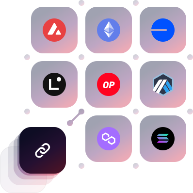

# Getting started

## deBridge IaaS

<figure><figcaption></figcaption></figure>

deBridge IaaS (Interoperability-as-a-Service) is the first service enabling complete cross-chain interoperability for any EVM or SVM blockchain ecosystems. It’s a turnkey solution that allows any chain to plug into deBridge infrastructure solving all three pillars of interoperability simultaneously including transfers of authenticated messages, cross-chain asset custody, and native high-performance value exchange (liquidity bridging).&#x20;

As a complete solution, deBridge IaaS can enable any chain to become fully composable within the global DeFi ecosystem, attracting developers, users, and liquidity from outside their ecosystem all with a subscription fee, paid on-chain. Blockchain ecosystems no longer have to solve each hurdle individually but instead can open up to global composability from day one.&#x20;


Get started here to initiate an IaaS subscription for your chain: [**https://app.debridge.finance/subscriptions**](https://app.debridge.finance/subscriptions)


### Features and opportunities include:

1. **deBridge Messaging:** Provides a decentralized infrastructure powering cross-chain message and data transfers — with authentication. deBridge allows smart contracts deployed across different EVM and SVM chains to establish an authenticated communication channel.
2. **DLN Cross-Chain Exchange:** A high-performance cross-chain trading infrastructure built on deBridge with a unique 0-TVL design. DLN offers zero slippage on any order size, deeper market depth, fastest settlement times, and native asset trading without wrapped assets and risks of locked liquidity.
3. **dePort Asset Custody:** Allows for seamless custody of assets from other networks in just one click. Projects and DAOs can scale effortlessly into neighboring ecosystems and create utility for their assets across different chains.

### Who is it for?

deBridge IaaS is a complete solution for any blockchain/ecosystem in the space, designed to make it easy to open up global interoperability.&#x20;

With a simple subscription fee, blockchains can solve all three interoperability challenges and make their ecosystem instantly accessible and composable from (and between) any EVM or SVM chain.&#x20;

### Pricing structure

deBridge IaaS works on a subscription-based model with monthly or quarterly payments. Any on-chain address can initialize a subscription by providing RPC for the network and performing the payment.

**The different pricing options available are:**

1. $11k/month with monthly payments or
2. $10k/month with quarterly/yearly payments

Once the IaaS smart contract accepts the payment, and smart contracts are deployed and correctly configured, deBridge validators will automatically pick up the blockchain and start validating messages coming to/from ecosystems. DLN market makers automatically start receiving quotes on all trades created, receiving the ability to monetize their liquidity, and fulfill trades coming to or from a new chain.&#x20;

Be aware that deBridge validation nodes perform continuous state and balance sheet validation. If there are any inconsistencies discovered (e.g. the total supply of dePort-issued assets calculated in the node differs from the total supply on-chain), validators will automatically stop operation for this chain and nullify the subscription without issuing any refunds.

### Risks for users

The process of IaaS subscription initialization is decentralized and performed through an IaaS smart contract, so deBridge doesn't perform due diligence on any blockchain ecosystems connected through IaaS and doesn't bear any responsibility for the quality and validity of the data returned by RPC of the chain, which is specified and provided by subscription governance address as one of the parameters.

Users who are interacting with any IaaS chains should do their own research about the chain and it's IaaS subscription parameters such as RPC and governance address (same as users of Uniswap who can buy any arbitrary token simply by specifying token address).&#x20;

### Getting started today

Get started by initiating an IaaS subscription for any chain here: [**https://app.debridge.finance/subscriptions**](https://app.debridge.finance/subscriptions)
