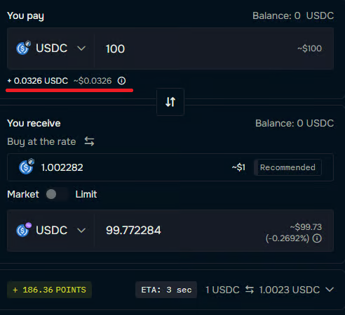

# prependOperatingExpenses

The `prependOperatingExpenses` setting is a `boolean`. It is recommended to enable this option:

```
prependOperatingExpenses = true
```

## Enabled (`prependOperatingExpenses=true`)

When enabled, [operating expenses](../../../fees-and-operating-expenses.md) are calculated separately from the spread and added on top of the input token amount, making all fees fully transparent. This approach helps clarify exactly what is being paid in fees.

For example, swapping 100 USDC on Arbitrum for 100 USDC on Polygon in [our application](https://app.debridge.finance/) displays a small fee (just over $0.03), shown above the red line in the figure below. This represents the solver's operating expenses.

<figure><figcaption><p>DeBridge app trading view, demonstrating <code>prependOperatingExpenses=true</code></p></figcaption></figure>

* **ERC20 Approval:** The total amount (including operating expenses) must be approved using the `approve` function. This value is provided in `response.estimation.srcChainTokenIn.amount`.
  * **Buffer Recommendations:** Estimates may need to be refreshed if there is a delay between generating the response and submitting `response.tx`. Updated operating expenses might require a new approval. Additional guidance is available [in this article](prependoperatingexpenses.md).
* **Fulfillment Likelihood:** When `response.tx` is signed and submitted within 30 seconds, the probability of successful execution is over 99.9%.

## Disabled (`prependOperatingExpenses=false`)

When disabled, `response.estimation.srcChainTokenIn.amount` equals the `srcChainTokenInAmount` specified in the original `create-tx` request. In this case, [operating expenses](../../../fees-and-operating-expenses.md) are subtracted directly from the spread between the input value and `response.estimation.dstChainTokenOut`.

Both modes produce the same execution outcome, but enabling `prependOperatingExpenses` typically provides a clearer breakdown of the fee structure for end users.
