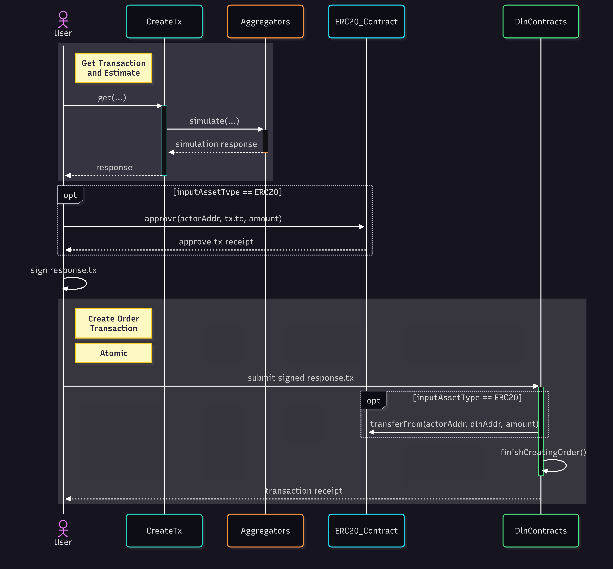

# Bridging Reserve Assets

This page outlines the behavior of input assets during order creation and provides a visual representation of the process for creating an order using reserve assets.

When interacting with the `create-tx` API, the [response ](../interacting-with-the-api/creating-an-order/api-response/)includes a `tx` field. To create an order, it is sufficient to sign the transaction and submit it to the network. The `data` field within `tx` contains all instructions necessary to create the order on the source chain.

The simplest scenario occurs when bridging [reserve assets](reserve-assets.md) from the source chain to the destination chain. In this case, the order creation process on the initiator’s side consists of three distinct steps:

* **Step 1:** Call `create-tx` API with the required [parameters](../interacting-with-the-api/creating-an-order/api-parameters/).
* **Step 2:** After receiving the [response](../interacting-with-the-api/creating-an-order/api-response/), call `approve` on the ERC-20 contract of the reserve assets. The spender should be set to the value in `response.tx.to`, and the approved amount should match the value specified in the transaction.
  * _Note: This step is required only for ERC-20 assets._
* **Step 3:** Sign and submit `response.tx` to the blockchain. This action locks the specified amount of [reserve assets](reserve-assets.md) on the source chain until the order is either [claimed by a solver ](order-fulfillment/claiming-the-order.md)or [cancelled by an authorized entity](../interacting-with-the-api/cancelling-the-order.md).&#x20;

<figure><figcaption>
Bridging reserve-assets
</figcaption></figure>

Once these steps are completed, the bridging process from the user's perspective is finished. The next actions involve either [monitoring the order’s status](../interacting-with-the-api/monitoring-orders/) or [initiating cancellation](../interacting-with-the-api/cancelling-the-order.md). Additional details on how solvers fulfill the order on the destination chain are available [here](order-fulfillment/).
