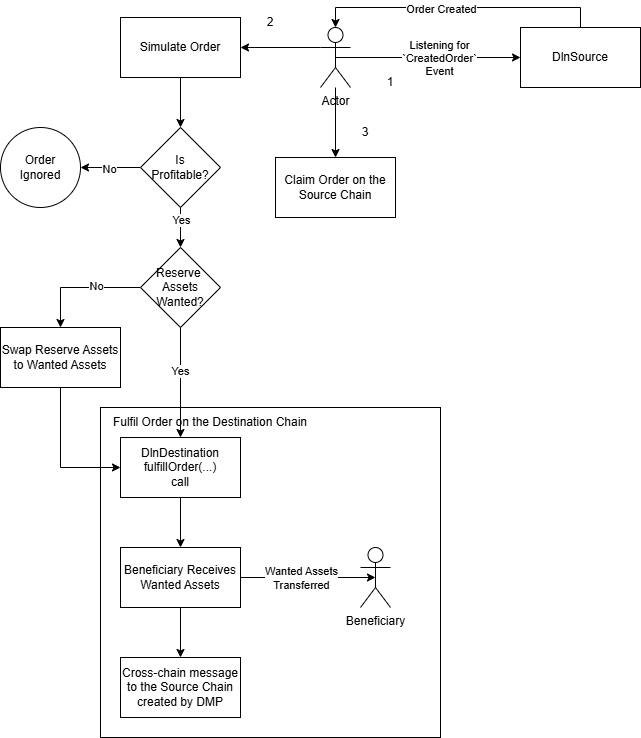

# Order Fulfillment

This page outlines secondary but relevant concepts related to order creation. While not central to the core flow for creating an order, they are important for transparency and for understanding various fields in the `create-tx` API [response](../../interacting-with-the-api/creating-an-order/api-response/).

Order fulfillment involves three distinct steps:

1. Detecting the created order on the source chain
2. Fulfilling the order on the destination chain
3. Claiming the order on the source chain

In total, a solver performs two transactions during the lifecycle of an order: one to fulfill it on the destination chain and another to claim the locked input assets on the source chain. The gas fees associated with both transactions are considered [operating costs](../../fees-and-operating-expenses.md) and should be factored in when creating an order.

<figure><figcaption>
Solver's Steps
</figcaption></figure>
