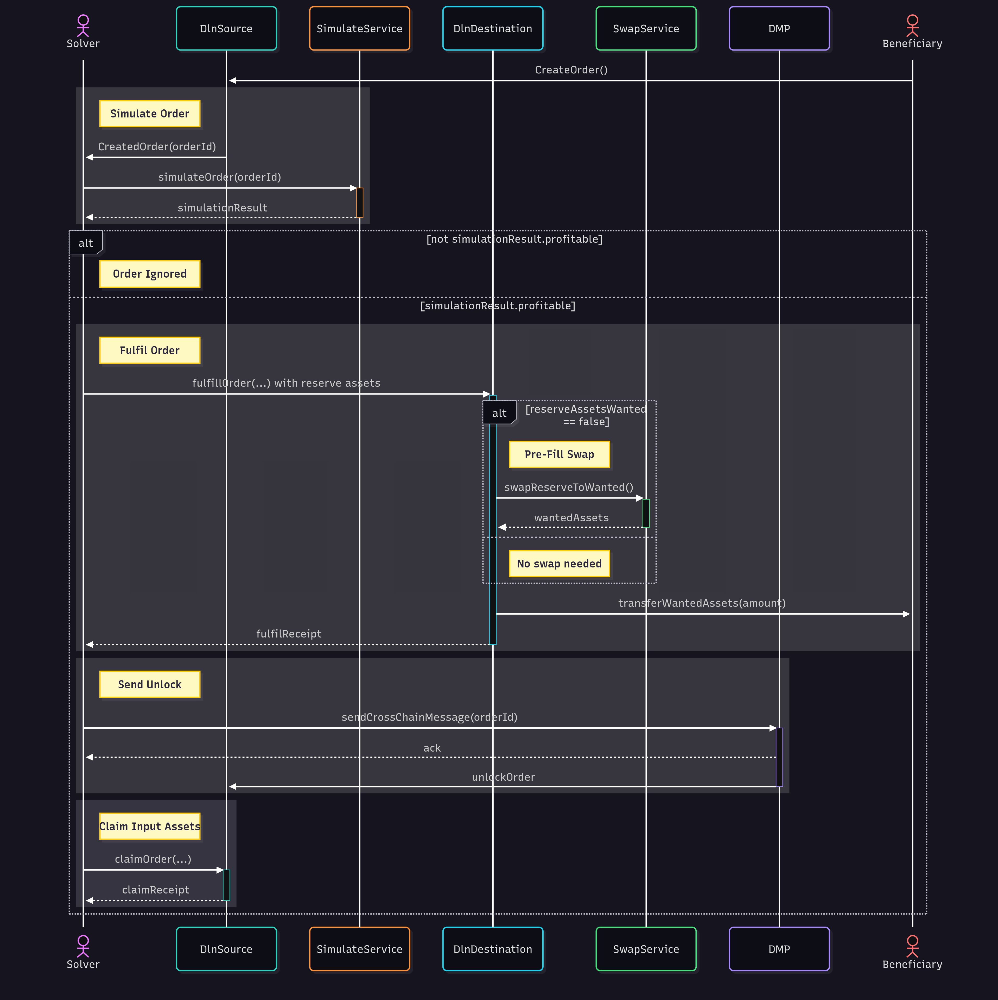

# Order Fulfillment

This page outlines secondary but relevant concepts related to order creation. While not central to the core flow for creating an order, they are important for transparency and for understanding various fields in the `create-tx` API [response](../../interacting-with-the-api/creating-an-order/api-response/).

Order fulfillment involves three distinct steps:

1. Detecting the created order on the source chain&#x20;
2. Fulfilling the order on the destination chain&#x20;
3. Claiming the order on the source chain

In total, a solver performs three transactions during the lifecycle of an order:&#x20;

* fulfilling it on the destination chain
* sending unlock message via DMP from destination to source chain
* claiming the locked input assets on the source chain

The gas fees associated with those transactions are considered [operating costs](../../fee-structure.md) and should be factored in when creating an order.

<figure><figcaption></figcaption></figure>
