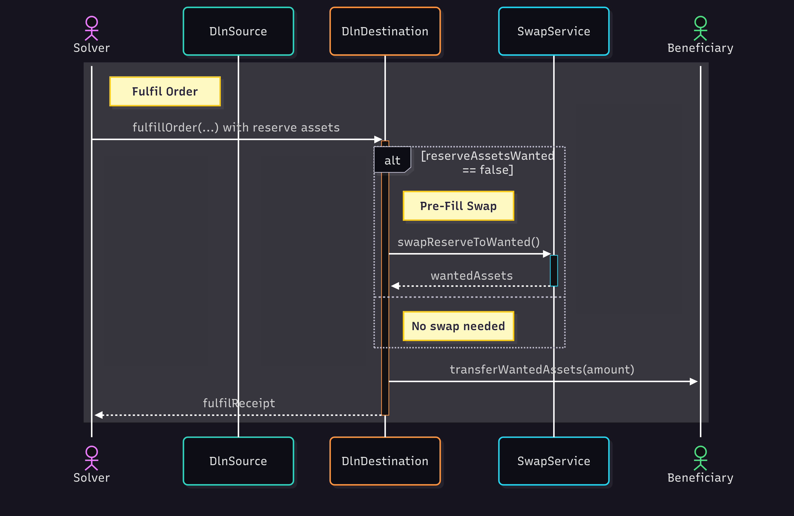

# Fulfilling the Order

After the `OrderCreated` event is detected, and solvers deem the order profitable, they enter the next stage of the process, illustrated by the green background in the diagram below.

<figure><figcaption>
Detecting and simulating an order, sequence diagram
</figcaption></figure>

Depending on order volume and the risk-to-reward ratio, there may be a delay before the solver submits the fulfillment transaction on the destination chain. This delay is influenced by the transaction finality characteristics of both the source and destination chains. Further details are available [here](https://github.com/debridge-finance/dln-taker?tab=readme-ov-file#managing-cross-chain-riskreward-ratio).

If the requested asset on the destination chain differs from the solver's available reserve assets, a [pre-fill swap ](pre-fill-swap.md)may occur. This swap is bundled with the fulfillment transaction and executed atomically. The solver deposits the final, requested assets into the `DlnDestination` contract via a `fulfillOrder(...)` method call. This transaction delivers the requested assets to the beneficiary address specified in the original order and updates the [order state](../../../interacting-with-the-api/monitoring-orders/order-states.md) to `Fulfilled`.
