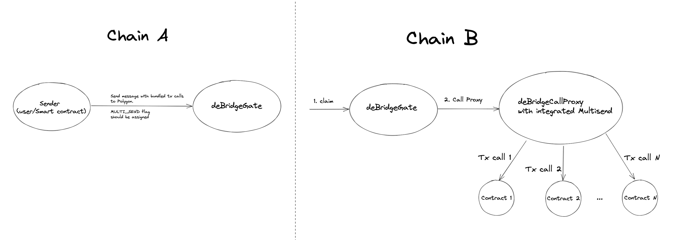
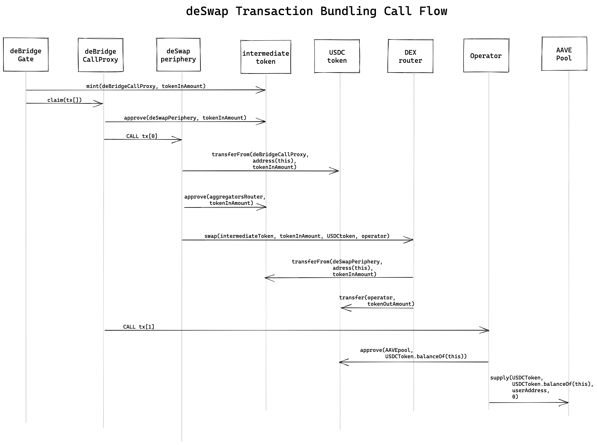

# Transaction Bundling

[deSwap API](https://debridge.finance/api) is a service that provides everyone with the ability to construct transactions to perform atomic cross-chain conversion of assets at the best market rates on top of the deBridge protocol. Still, there are cases when a conversion itself is not a goal, but rather the first step towards a broader intention on the destination chain: e.g. one may want to stake the resulting token on behalf of a user, buy an NFT or perform an arbitrage immediately after the swap, take a flash loan or call a third party contract's hook, or... the sky is the limit! \
\
This has always been possible by sending at least two transactions: the first is the cross-chain transaction responsible for the arbitrary token swap, and the second is to perform the intended operation. Sounds like neither a truly decentralized nor user-friendly way!

Since the deBridge protocol offers the ability to pass multiple transaction calls to the destination blockchain using the new `MULTI_SEND` flag (leveraging battle-tested [gnosisSafe transaction builder](https://help.gnosis-safe.io/en/articles/4680071-transaction-builder) multisend library), the deSwap API now offers transaction bundling. It's a way to optionally pass multiple transaction calls that will be invoked sequentially one after another on the destination chain after the conversion is done and the target token (the result of a cross-chain swap) is obtained. This opens limitless possibilities for performing custom operations with the target token straight within the same atomic cross-chain transaction!



### Use case example: supply the resulting tokens into the AAVE pool on behalf of a user

Say, a liquidity pool wants to ease the onboarding of liquidity providers and decides to simplify the supply from other chains. It may use the deSwap API to construct a cross-chain transaction that will perform a swap from an arbitrary token to this pool's token, and immediately stake the resulting amount of this pool's token. An example of an application that implements this tx bundling logic with the AAVE protocol can be found here: [https://stake-aave.debridge.finance/stake-aave](https://stake-aave.debridge.finance/stake-aave)

#### Understanding the technical design and the flow

Simply speaking, the deSwap API just constructs a transaction in the source blockchain that must invoke the external aggregator's router to swap the input token to the target token and transfer the resulting amount of the target token to a given address on the destination chain. Then, this swap transaction is passed to the deBridge gate which executes it on the destination chain upon arrival.

When providing multiple transaction calls to be invoked on the destination chain, deBridge gate unpacks and executes them sequentially, one after another, and the first transaction is always a swap. These transactions are executed as a bundle, meaning all of them must succeed ("all or nothing"); if any transaction fails, the execution is reverted and intermediary tokens are sent to the fallback address.

Obviously, these calls can neither communicate with each other nor pass their results to the upcoming calls. To eliminate this, we suggest developing and deploying an _operator smart contract_ – a transitory contract representing a receiver for the resulting amount of the target token – which will perform the desired operation against this amount upon invocation. In case this operation fails, the whole transaction is reverted effectively eliminating possible losses.

The call flow involving the operator smart contract may look as follows:



#### Deploying the operator smart contract

You need to deploy an operator smart contract that will perform the desired operation with the target token. This contract must expect the resulting amount of the target token to be at its address upon invocation. A generic implementation of such an operator may look like this:

```solidity
/**
 * @param _aavePoolAddress The address of a pool to supply the asset to
 * @param _stakeAssetAddress The address of the underlying asset to mint
 * @param _onBehalfOf The address that will receive the aTokens
 * @param _fallbackAddress The address that will receive the unused amount of asset
**/
function stake(
    address _aavePoolAddress,
    address _stakeAssetAddress,
    address _onBehalfOf,
    address _fallbackAddress
) external {
    IERC20Upgradeable stakingAsset = IERC20Upgradeable(_stakeAssetAddress);
    uint256 stakeAmount = stakingAsset.balanceOf(address(this));
    stakingAsset.safeApprove(_aavePoolAddress, stakeAmount);
    IPool(_aavePoolAddress).supply(
        _stakeAssetAddress,
        stakeAmount,
        _onBehalfOf,
        0
    );
    stakingAsset.safeApprove(_aavePoolAddress, 0);

    uint256 balanceAfter = stakingAsset.balanceOf(address(this));
    if (balanceAfter > 0) {
        stakingAsset.safeTransfer(_fallbackAddress, balanceAfter);
    }
}
```

#### Estimate the operator smart contract gas consumption

You need to test this operator smart contract to ensure it does what it is intended to do. For example, if you are willing to supply [USDC](https://polygonscan.com/address/0x2791Bca1f2de4661ED88A30C99A7a9449Aa84174) to [AAVE pool](https://polygonscan.com/address/0x794a61358D6845594F94dc1DB02A252b5b4814aD) on Polygon, then you:

1. Transfer a small amount of USDC to the operator's smart contract address;
2. Call this operator's `stake()` method, passing the appropriate values to its arguments:

* `_aavePoolAddress=0x794a61358D6845594F94dc1DB02A252b5b4814aD` (AAVE USDC pool on Polygon);
* `_stakeAssetAddress=0x2791Bca1f2de4661ED88A30C99A7a9449Aa84174` (USDC on Polygon);
* `_onBehalfOf` is a user's wallet address;
* `_fallbackAddress` is a user's wallet address (typically the same as above).

As the result of this test call, you must expect to receive this pool's aTokens to the user's wallet address. Additionally, you must mind the amount of gas this transaction consumed. This is crucial for estimating the cost of the whole cross-chain transaction.

#### Constructing the cross-chain transaction

Now you may start constructing your cross-chain transaction by calling the deSwap API. This is already being covered by our extensive [quick start guide](https://docs.debridge.finance/deswap/api-quick-start-guide). There are still a few minor (though very important) differences.

**1️⃣ First**, you need to encode the call to your operator smart contract and pass it to the `/v1.0/transaction` endpoint as the `dstChainTxBundle` parameter. Say, we want to supply [USDC](https://polygonscan.com/address/0x794a61358D6845594F94dc1DB02A252b5b4814aD) to [AAVE pool](https://polygonscan.com/address/0x2791Bca1f2de4661ED88A30C99A7a9449Aa84174) on behalf of the user wallet `0x0000000000000000000000000000000000000001` address, so encoding this call:

```js
const operatorCall = operatorContract
    .methods
    .stake(
        '0x794a61358D6845594F94dc1DB02A252b5b4814aD', // address _aavePoolAddress, Aave: Pool V3
        '0x2791Bca1f2de4661ED88A30C99A7a9449Aa84174', // address _stakeAssetAddress, USDC
        '0x0000000000000000000000000000000000000001', // address _onBehalfOf, user's wallet address
        '0x0000000000000000000000000000000000000001' // address _fallbackAddress, user's wallet address
    )
    .encodeABI();
```

will give the following machine-readable code:

> `0x38426877000000000000000000000000794a61358d6845594f94dc1db02a252b5b4814ad000000000000000000000000794a61358d6845594f94dc1db02a252b5b4814ad00000000000000000000000000000000000000000000000000000000000000010000000000000000000000000000000000000000000000000000000000000001`.

**2️⃣ Second**, put the address of your operator smart contract along with the operator call constructed above to the `dstChainTxBundle` parameter; separate the address and the call with the comma, and separate each transaction (if there are multiple transactions) with a semicolon:

> `dstChainTxBundle=0xOpErAtOrCoNtRaCtAdDrEsS00000000000000001,0x38426877000000000000000000000000794a61358d6845594f94dc1db02a252b5b4814ad000000000000000000000000794a61358d6845594f94dc1db02a252b5b4814ad00000000000000000000000000000000000000000000000000000000000000010000000000000000000000000000000000000000000000000000000000000001`

This parameter will make the deSwap API backend smartly combine the swap call with the given call into a bundle to be atomically invoked on the destination chain.

**3️⃣ Third**, put the estimated operator smart contract gas consumption to the `dstBaseGasAmount` parameter: this will allow the deSwap API backend to correctly calculate the recommended gas fee to include (former _execution fee_, _a small amount of the intermediary token that incentivizes anyone to execute the transaction on the destination chain_).

**4️⃣ Fourth**, set the `dstChainTokenOutRecipient` parameter to the address of your operator smart contract rather than the user wallet's address. This is extremely important as we agreed that the resulting amount of target tokens will be transferred to the operator smart contract which will be called in the same atomic transaction performing the operation you've encoded above.

That's it! You've successfully bundled additional transactions within the atomic cross-chain transaction via deBridge.

### Conclusion

With the immediate availability of transaction bundling, protocols and DAOs may perform arbitrary cross-chain interactions, leveraging the battle-tested and audited deBridge protocol.
