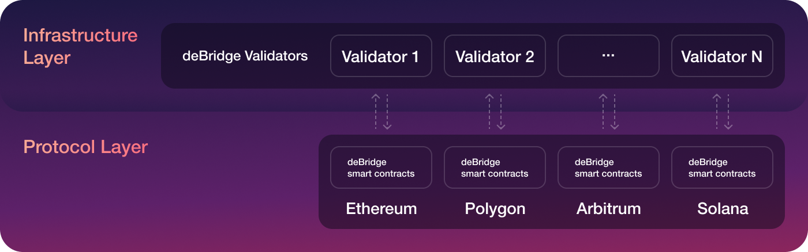
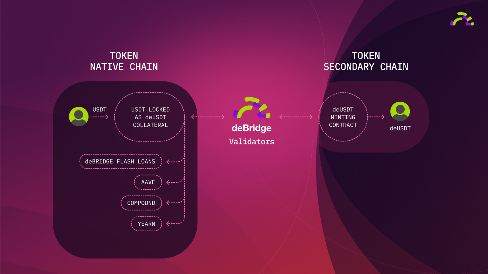

# Protocol Overview

## Background

Cross-chain value transfers are one of the cornerstones in the world of truly decentralized finance. Blockchains are secure but isolated networks that don't have access to real-world data as well as to the state of other chains. Moreover, users have to rely on third-party services and centralized solutions, which are likely to request sensitive information or be susceptible to censorship. Every time a user performs a transfer through centralized bridges, the person has to bear the risk of their funds either being stuck due to an imbalance of liquidity on one of the sides of the bridge or being frozen due to centralization.

**deBridge** aims to solve these problems and become a decentralized standard for cross-chain liquidity transfers and overall interoperability of smart contracts in different chains.

## Protocol Structure

The protocol consists of 2 key layers:

* Protocol layer — on-chain smart contracts deployed in every blockchain supported by deBridge
* Infrastructure layer — off-chain validation nodes operated by validators who are elected by deBridge governance

**The protocol layer** is a set of on-chain smart contracts that are used for asset management, routing of cross-chain transactions, cross-validation of validators signatures, and to reach consensus among validators as the transaction is treated as valid only if the minimum required threshold of validators signatures is achieved. The governance manages the parameters of the smart contracts, such as fees, supported chains, the whitelist of elected validators, validators payout ratio, and more.

**The infrastructure layer** is represented by a set of reputable validators who operate a deBridge node alongside full nodes of every blockchain supported by the protocol.&#x20;

### **Off-chain validation**

For all bridging protocols, it’s important to have a chain-agnostic design and make the protocol operation fully independent of the uptime of all supported blockchains. In case of the stop of any underlying blockchains, the protocol should keep processing the transactions for all other chains.&#x20;

deBridge has taken a unique approach with off-chain transactions validation mechanic when validators don’t need to broadcast any transactions and bear gas costs. Every cross-chain transaction initiated through the deBridge smart contract is assigned a unique identifier (hash). deBridge validators are tracking all transactions that pass through the smart contract of the protocol and soon as the transaction achieves its finality, each validator is obliged to sign by its private key a unique identifier of the transaction. The resulting signature is saved into [IPFS](https://ipfs.io) so that anyone can retrieve it. Any arbitrary user or keeper can collect validators' signatures from IPFS and pass them to deBridge smart contract in the target chain alongside all transaction parameters. Based on the passed set of parameters deBridge smart contract will restore a unique hash of the transaction and cross-validate its signatures from all designated validators. In case the minimum required number of signatures is valid, DebridgeGate smart contract executes the transaction and call data transferred to the destination chain.

With this design, even if some blockchain would go offline, deBridge will still be functioning as expected and all transactions going to the paused chain will be processed as soon as it’s up again.

### Delegated Staking and Slashing

Validators play a crucial role in interoperability protocols since in addition to being infrastructure providers, they also secure the protocol by validating all cross-chain transactions passing through the protocol. Validators work for and are elected by the governance and should bear financial responsibility for the service they provide through the risk of being slashed in case of validating a non-existent transaction or long downtime of the infrastructure. Anyone can help to secure the protocol by being a delegator and staking assets (e.g. ETH, USDC) for validators’ collateral. Both validators and their delegators receive part of the protocol fees as an economic incentive for helping to secure the protocol and maintaining its infrastructure. More details can be found in the [Slashing and Delegated Staking section.](slashing-and-delegated-staking.md)

## Security Audits

* **Halborn** ([published on Github](https://github.com/debridge-finance/debridge-security/blob/master/deBridge\_Main\_Smart\_Contract\_Security\_Audit\_Report\_Halborn\_v1\_1.pdf))
* **Zokyo** ([published on Github](https://github.com/debridge-finance/debridge-security/blob/master/deBridge\_Main\_Smart\_Contract\_Security\_Audit\_Report\_ZOKYO.pdf))
* **Ackee Blockchain** (to be published)

## How it works

**deBridge is more than a bridge** — it's a generalized insured interoperability protocol that allows users and protocols to transport not only assets but also arbitrary messages or call\_data cross-chain.

.png>)

The ability to pass arbitrary data opens up opportunities for true cross-chain composability of smart contracts and protocols that now can interact with each other despite they live in different blockchain ecosystems. An example would be an algorithmic stablecoin protocol in Ethereum that opens positions in perpetual markets protocol on Solana or Arbitrum in order to maintain the peg of its asset.

deBridge allows building a new generation of cross-chain protocols and applications that haven’t been possible in the past. Some of the use cases are:

* Cross-chain swaps
* Multi-chain governance
* Cross-chain lending
* Cross-chain yield farming

## Cross-chain transfer of assets

.png>)

### Naming

The protocol utilizes a locking and minting approach where the native token is locked/unlocked in a deBridgeGate smart contract in the native chain and wrapped asset (deAsset) is minted/burnt in secondary chains.

For each asset, under the **native chain**, we assume the unique blockchain where the token was originally created.

**Secondary chains** are blockchains supported by deBridge to which tokens can be transferred/bridged and where deAssets are minted.

### Collateralization

Each of the tokens locked in the native chain have the associated wrapped asset on the target chains. By design, the protocol ensures that the total supply of each deAsset that can be minted in secondary chains is always 1:1 backed by the asset collateral locked in the deBridgeGate smart contract in the native chain. That provides a flawless user experience and guarantees that the user will never face a liquidity imbalance problem which is often encountered in other bridging solutions, where users face significant delays after they already locked liquidity in the bridge.

### Protocol Fees

The protocol takes a small fee for each transfer performed through deBridge. A small fee is what users pay for confidence and decentralization since half of all fees go as a reward to deBridge validators who are [financially liable](slashing-and-delegated-staking.md) for the proper operation of the protocol.

The fee consists of two components **(Fix + %)**:

* Fix - a fixed amount that is taken in the base asset of the blockchain. For example, if the transfer is performed from the Ethereum chain, then the fixed ETH amount will be deducted from the user's wallet towards the protocol treasury on Ethereum. The fixed fee is also required for Cross-chain interoperability when the smart contract in one blockchain can invoke an arbitrary method of the smart contract in another chain without the need of transferring any liquidity.
* Percent (%) - a percentage of each amount of bridged liquidity. Similar to Uniswap and many other DeFi protocols, deBridge takes a small 10 BPS (0.1%) fee from each transfer.

### Listing at deBridge

The deBridge protocol is universal and there are no listing requirements. Any arbitrary token can be bridged. If the token is bridged for the first time, together with the validation transaction validators unique deploy id that is passed to the destination chain and contains the following parameters:

* Native token smart contract address
* Native chain Id
* Token name
* Token symbol
* Decimals

The wrapped (deAsset) is deployed in the target chain automatically together with the first claim of the wrapped asset. Thus, no additional actions are required from the user, listing is performed automatically by deBridge validators who sign unique deployment ID. In deBridge we care about user experience and strive to minimize unnecessary actions to be performed by protocol users.

### Partial Liquidity Provision

One of the features of the deBridge protocol is that it tends to effectively utilize liquidity locked as collateral for deAssets. Any token locked in collateral can be taken by users in a form of flash loans. Upon governance decision, part of the specific asset liquidity can be supplied into reliable DeFi protocols like AAVE, Compound which should be approved by deBridge governance. Normally that should be strategies without impermanent loss with the ability to retrieve liquidity at any given moment. Most probably governance will whitelist strategies only after receiving decentralized insurance from protocols like Nexus Mutual or Unslashed.

