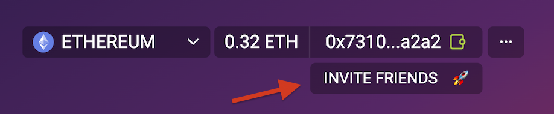

# Protocol Overview

## Background

For a long time, bridges were viewed only as value transfer protocols and custodians that are responsible for locking assets on the source chain and issuing wrapped representations of the assets on the destination chain.

deBridge protocol drastically expands the concept of traditional bridges by introducing generic cross-chain message transfers. Now developers and builders can interconnect any smart contracts across different blockchains to perform transfers of data and transaction calls (messages that contain instructions to be executed, or `CALLDATA`) together with the value transfer in the same transaction.&#x20;

This opens up endless opportunities to build complex cross-chain interactions, such as multi-chain applications, next-layer protocols, automated cross-chain arbitraging services, object or NFT bridges, and more!&#x20;

As a generic messaging protocol and a cross-chain interoperability infrastructure, deBridge can be used to build any arbitrary cross-chain applications (deApps). Notable solutions built on top of deBridge are:

* [deSwap](https://app.debridge.finance/) — solution for capital-efficient cross-chain swaps between arbitrary liquid assets, and&#x20;
* deNFT — an infrastructure for cross-chain NFTs transfers and solution to create a cross-chain native NFTs
* [dePort](https://app.debridge.finance/deport) —  a native bridge for assets that allows protocols to bridge tokens and create utility for their synthetic representation (deTokens) in other chains

Your application can be the next one and this documentation and tutorials will help to dive into the protocol infrastructure and elaborate on peculiarities you might face while building your integration with deBridge.

## Protocol Structure

The protocol consists of 2 key layers:

* Protocol layer — on-chain smart contracts deployed in every blockchain supported by deBridge
* Infrastructure layer — off-chain validation nodes operated by validators who are elected by deBridge governance

**The protocol layer** is a set of on-chain smart contracts that are used for routing of cross-chain messages, cross-validation of validators' signatures, and reaching consensus among validators as the transaction is treated as valid only if the minimum required threshold of signatures is achieved. The governance manages the parameters of the smart contracts, such as fees, supported chains, the whitelist of elected validators, validators payout ratio, and more.

**The infrastructure layer** is represented by a set of reputable validators who operate a deBridge node alongside full nodes of every blockchain supported by the protocol.&#x20;

### **Off-chain validation**

For all bridging protocols, it’s important to have a chain-agnostic design and make the protocol operation being fully independent of the uptime of all supported blockchains. In case of a pause in any underlying blockchain, the interoperability protocol should keep processing the transactions for all other chains.&#x20;

deBridge has taken a unique approach with an off-chain transactions validation mechanic when validators don’t need to broadcast any transactions and bear gas costs. Every cross-chain transaction initiated through the deBridge smart contract is assigned a unique hash (Submission Id). deBridge validators are tracking all transactions that pass through the smart contract of the protocol and soon as the transaction achieves its finality, each validator is obliged to sign the Submission by its private key.&#x20;

The resulting signature is saved into [IPFS](https://ipfs.io) so that anyone can retrieve it. Any arbitrary user or keeper can collect validators' signatures from IPFS and pass them to deBridge smart contract in the target chain alongside all transaction parameters. Based on the passed set of parameters deBridge smart contract will restore a unique hash of the transaction and cross-validate its signatures from all designated validators. In case the minimum required number of signatures are valid, DebridgeGate smart contract executes the transaction and call data transferred to the destination chain.

With this design, even if some blockchains would go offline, deBridge will still be functioning as expected and all transactions going to the paused chain will be processed as soon as it’s up again.

### Delegated Staking and Slashing

Validators play a crucial role in interoperability protocols since, in addition to being infrastructure providers, they also secure the protocol by validating all cross-chain transactions passing through the protocol. Validators work for and are elected by the governance and should bear financial responsibility for the service they provide through the risk of being slashed in case of validating a non-existent transaction or long downtime of the infrastructure. Anyone can help to secure the protocol by being a delegator and staking assets (e.g. ETH, USDC) for validators’ collateral. Both validators and their delegators receive part of the protocol fees as an economic incentive for helping to secure the protocol and maintain its infrastructure. More details can be found in the [Slashing and Delegated Staking section.](slashing-and-delegated-staking.md)

## How it works

**deBridge is more than a bridge,** it's a secure interoperability layer for Web3 that enables users and protocols to transport not only value but also arbitrary messages or `CALLDATA` across different chains.

The ability to pass arbitrary data opens up opportunities for true cross-chain composability of smart contracts and protocols that can now interact with each other despite they live in different blockchain ecosystems. An example would be an algorithmic stablecoin protocol on Ethereum that opens positions in perpetual markets protocol on Solana or Arbitrum in order to maintain the peg of its asset.

deBridge allows building a new generation of cross-chain protocols and applications that haven’t been possible in the past. Some of the use cases are:

* Cross-chain swaps
* Multi-chain governance
* Cross-chain lending
* Cross-chain yield farming

### Protocol Fees

The protocol takes a small fee for each transfer performed through deBridge. A small fee is what users pay for confidence and decentralization since half of all fees go as a reward to deBridge validators who are [financially liable](slashing-and-delegated-staking.md) for the proper operation of the protocol.

The fee consists of two components **(Fix + %)**:

* Fix - a fixed amount that is taken in the base asset of the blockchain. For example, if the transfer is performed from the Ethereum chain, then the fixed ETH amount will be deducted from the user's wallet towards the protocol treasury on Ethereum. The fixed fee is also required for cross-chain interoperability when the smart contract in one blockchain can invoke an arbitrary method of the smart contract in another chain without the need of transferring any liquidity.
* Percent (%) - a percentage of each amount of bridged liquidity. Similar to Uniswap and many other DeFi protocols, deBridge takes a small 10 BPS (0.1%) fee from each transfer.
