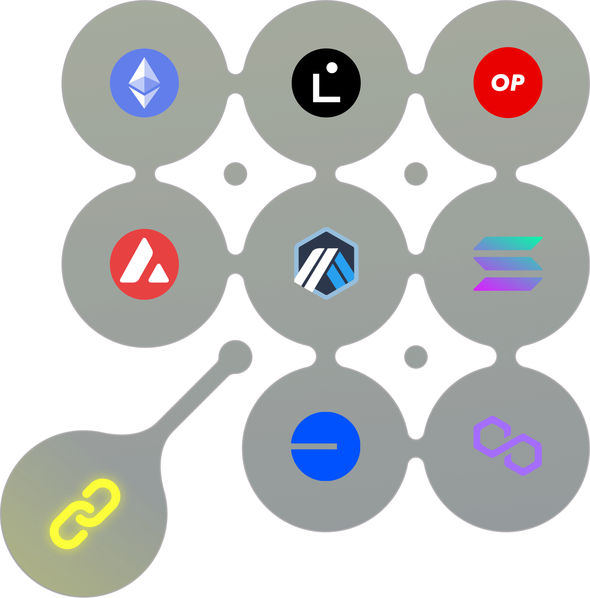

# Transfers Flow



## Transfers From Native Chain

Let's consider the situation where the user or smart contracts performs a transfer of the asset and data from chain A to chain B. Then the following steps are performed:

* If the transferred asset isn't the base blockchain asset (i.e ETH or BNB) the approve method is called or permit is signed. Then the `send` method of `DebridgeGate` contract is invoked. The transferred amount of the asset is locked in the smart contract or burnt (for deAssets in secondary chains). The % component of the protocol's fee is deducted from the amount and transferred to the treasury, `fix` component of the fee is paid by the user in the base chain asset and also transferred to the treasury.
* DebridgeGate smart contract calculates the unique hash of cross-chain transaction based on the set of unique parameters:

```
 _debridgeID =  keccak256(abi.encodePacked(_chainId, _tokenAddress));
 
 bytes memory packedSubmission = abi.encodePacked(
            SUBMISSION_PREFIX,
            _debridgeId,
            getChainId(),
            _chainIdTo,
            _amount,
            _receiver,
            nonce
        );
        
submissionId = keccak256(
                abi.encodePacked(
                    packedSubmission,
                    autoParams.executionFee,
                    autoParams.flags,
                    keccak256(autoParams.fallbackAddress),
                    isHashedData ? autoParams.data : abi.encodePacked(keccak256(autoParams.data)),
                    keccak256(abi.encodePacked(msg.sender))
```

`debridgeID` is a hash of concatenation of the token native chain Id and native token address.

* deBridge validation nodes track events emitted by `deBridgeGate` smart contract and after a minimum number of blocks confirmations validators submit the transfer identifier (submissionId) to the `deBridgeAggregator` contract in the target chain. `submissionId` is calculated as a hash of concatenation:
* The user or any arbitrary waller (e.g. Keeper service) can call `claim` method of `deBridgeGate` by passing all transaction parameters and all valudators' signatures. Smart contract will restore `submissionId` based on the set of passed parameters and if minimal required number of validators signatures is valid, the transaction is treated by protocol as valid and the asset is minted/unlocked to the receiver address and data is executed through the callProxy.

deBridge protocol supports **multi-chain routing** when users can transfer deAssets between secondary chains directly, without the need to route them through the native chain. These transfers work in the same way, but deAsset is burnt in the chain where the transfer is originated and the corresponding amount of deAsset is minted in the target chain

## Cross-Chain Transfers Execution Time

Cross-chain transfer through deBridge normally takes a few minutes and the delay is caused by two factors:

1. The finality of transaction in the blockchain where the transfer is originated
2. Time required for claim transaction to get into the block in the destination chain

Each blockchain has a different block generation time and requires a different number of block confirmations for ensured transaction finality, thus before validating the transaction validators must wait for its finality
