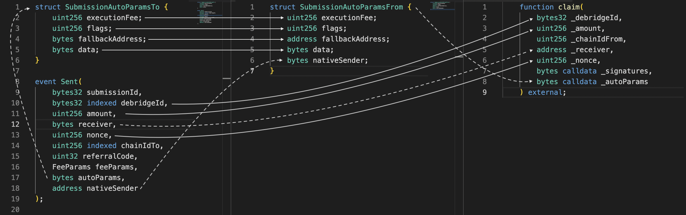

# Gathering data for the claim

To claim a submission, a call to the `deBridgeGate.claim()` method on the destination chain must be crafted using data taken from various sources. Though deSDK already [provides a handy method](https://github.com/debridge-finance/desdk#tracking-and-executing-claims) for this, we explain here where to take and how to prepare this data.&#x20;

* `_debridgeId`, `_amount`, `_receiver`, `_nonce` can be taken from the corresponding args of the `Sent` event,
* `_chainIdFrom` is obviously the ID of the origin chain,
* `_signatures` is the string with the signatures concatenated without a delimiter (don't forget to strip hexadecimal prefixes from each but the first); signatures can be pulled from the deBridge API,
* `_autoParams` is the encoded `SubmissionAutoParamsFrom` struct, which is the derivative of the `SubmissionAutoParamsTo` with `nativeSender` taken from the `Sent` event: so you need to decode `_autoParams` against the `SubmissionAutoParamsTo` struct, add the fifth element, and encode back against the `SubmissionAutoParamsFrom` struct.

This simple diagram shows the flow of the properties; dashed lines indicate the necessity of data decoding/encoding/unpacking/packing, while the straight line shows that the datum should be passed as is:

After all these elements are combined into one single call, you can sign and broadcast your transaction and wait for the `Claimed` event. This will indicate a successful submission.
